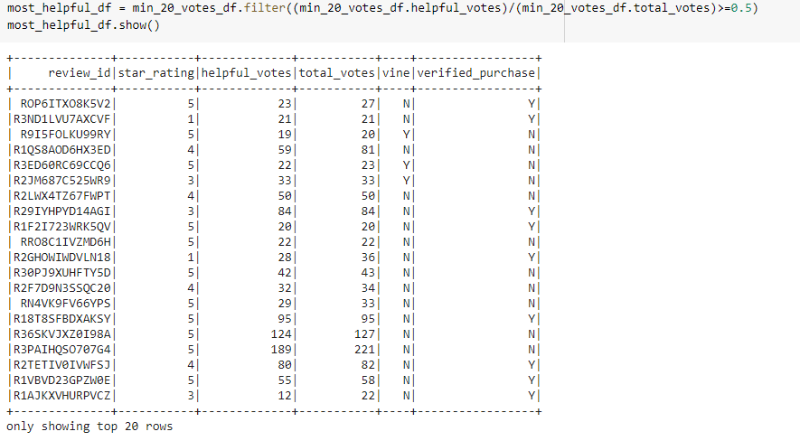

# Amazon Vine Analysis
## Overview
### This project is intended to analyze Amazon reviews written by members of the paid Amazon Vine Program. For a small fee to Amazon, manufacturers and publishers can submit products to be reviewed by Amazon Vine members. These members are paid to publish reviews of submitted products. 
### By analyzing these reviews, we can determine if there is any bias toward favorable (5-star) reviews by Vine members. 
### The dataset utilized for this analysis relates to toy reviews.

## Resources
**Data Source:** 

- https://s3.amazonaws.com/amazon-reviews-pds/tsv/amazon_reviews_us_Toys_v1_00.tsv.gz

**Program:**

- PySpark
- spark-3.0.3

## Results

The original dataset contained 4,864,249 toy reviews. The data was filtered down to only reviews with at least 20 total votes, and of those votes, at least 50% were considered helpful. This resulted in a working dataset with 63,294 reviews.

Vine summary:

- Total vine reviews: 1,266
- 5-star vine reviews: 432
- Percentage of 5-star vine reviews: 34.12%

Non-Vine summary:

- Total non-vine reviews: 62,028
- 5-star non-vine reviews: 29,982
- Percentage of 5-star non-vine reviews: 48.34%

## Summary

There does not appear to be a bias toward positive reviews within the Amazon Vine Program, despite compensation. Only about a third of reviews within the Vine program were given 5 stars while nearly half of non-paid reviews were given 5 stars. 

This could potentially indicate that Amazon Vine members are more thorough in their reviews and judge more critically when being compensated. However, Vine reviews only account for **2%** of overall reviews within the working dataset, so further insight into the program is advised.

An additional analysis to look into is the percentages of paid and unpaid 5-star reviews for toys that have less than 20 votes. It is possible that Amazon Vine Members review new toys that shoppers may not be aware of, or "less-popular" toys that shoppers avoid. This new dataset could increase the number of total Vine reviews, creating a larger data pool to examine how Vine members review products.
